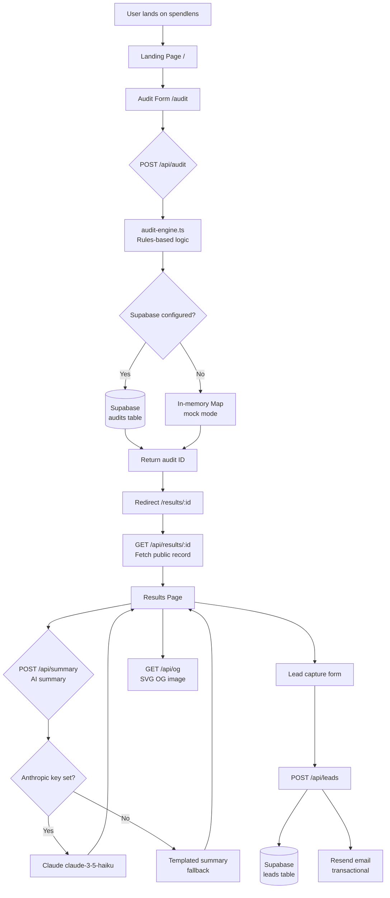

# Architecture — SpendLens

## System Diagram

## Data Flow: Input → Audit Result

1. User fills the 3-step form (`/audit`) with tool name, plan, monthly spend, and seats
2. Form state is persisted to `localStorage` on every change (key: `spendlens_audit_form`)
3. On submit, `POST /api/audit` receives `{ teamSize, useCase, tools[] }`
4. `runAudit()` in `lib/audit-engine.ts` maps each tool through `auditTool()`:
   - Checks if the current plan is overkill for the given seat count
   - Checks if a cheaper plan from the same vendor fits
   - Checks if an alternative tool better fits the use case
   - Returns per-tool savings + reason
5. The result is stored in Supabase (or in-memory in mock mode) with a `nanoid(10)` primary key
6. The user is redirected to `/results/:id`
7. The results page fetches the record via `GET /api/results/:id` (server-side for OG metadata)
8. The client component calls `POST /api/summary` to generate an AI summary (async, shown after load)
9. The share URL (`/results/:id`) is permanent and public; it contains no PII

## Stack Rationale

| Choice | Reason |
|---|---|
| **Next.js 14 (App Router)** | Server components for per-result OG metadata; API routes for backend logic; TypeScript first-class; Vercel zero-config deploy |
| **TypeScript** | Type safety across the audit engine prevents silent bugs in savings calculations; all tool/plan types are exhaustively typed |
| **Tailwind CSS** | Utility-first allows rapid iteration on the results page design without stylesheet bloat |
| **Supabase** | Free tier, instant setup, PostgreSQL with RLS, no server management |
| **Anthropic Claude Haiku** | Fast (< 1s) and cheap for 100-word summaries; graceful fallback means no user-facing error if quota runs out |
| **Resend** | 100 free emails/day is sufficient for early traction; simple API with HTML templates |
| **Vitest** | ESM-native, faster than Jest, compatible with the Next.js TypeScript config |
| **nanoid** | URL-safe unique IDs for audit results; 10 chars = 1 billion IDs before collision |

## What Would Change at 10k Audits/Day

1. **Move audit storage to a dedicated write path** — the current in-memory fallback doesn't survive server restarts; at scale, Supabase connection pooling via `pgbouncer` or a dedicated Postgres instance on Render would be needed
2. **Cache AI summaries** — at 10k audits/day, generating a summary per audit costs ~$15/day on Haiku; cache by audit result hash or generate summaries async after delivery
3. **Rate limiting at the edge** — move rate limiting from in-memory `Map` to Vercel Edge Config or Upstash Redis so it works across multiple serverless function instances
4. **OG image CDN** — cache the SVG OG images in Cloudflare or Vercel's edge cache to avoid regenerating per crawl request
5. **Queue email delivery** — replace synchronous Resend calls with a background queue (e.g., Inngest or Trigger.dev) to keep API response times under 200ms
